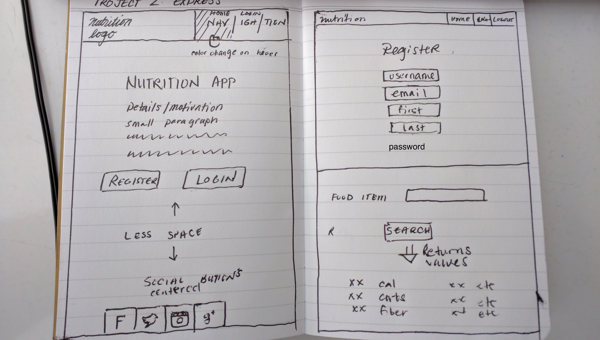

# Project 2 Express

# Nutrition App

## API

https://www.nutritionix.com/business/api
A nutrition api that draws from both grocery and restaurant items and 
returns the nutritional value of the requested food item.

## User Stories

Anywhere you look today you can find new fad diets and health foods and 
with any diet there are cheat foods/days. What all of them have in common
is to be able to keep track of what you eat. With this app, you should be 
able to get the nutritional value of both groceries as well as restaurant
items to keep track of what you eat.

## Technologies Used

html/ejs, node, express, mvc, sql/pg-promise, css, javascript/jquery

## Database Structure

Need atleast two tables
One for users with (userid, username, first_name, last_name)
Second for nutritional values (food_id, )

## Basic Functionality

Basic functionality should be the ability to register log in and request
a food item and get the values returned.

## Minor Addition

Once that step is reached I would like to set a goal for the day such as
"I would like to eat X calories for the day". Have a method to get the 
total of the items entered and see if you met your goal.

## Advanced Features
Beyond that I would like to utilize https://www.npmjs.com/package/twitter 
incorporate some way to show accountability like maybe incorporate a twitter
api that would tweet out that you met or stayed under/over you goal calories for the day.
